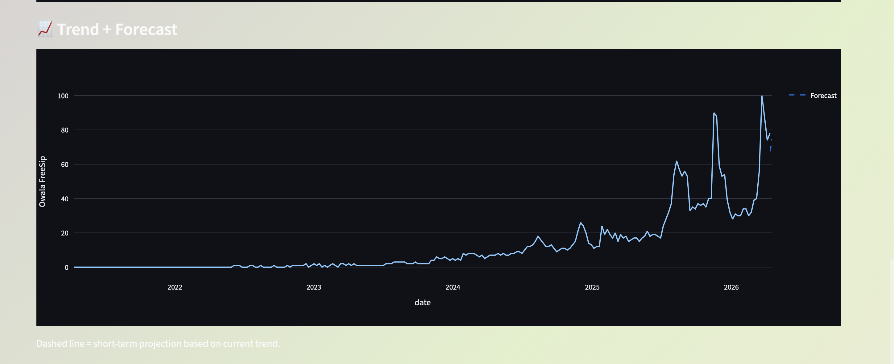

# 🌈 Hype Radar — Product Intelligence System

**A multi-source hype intelligence system that turns fragmented attention signals into product momentum insights and decision recommendations.**

---

## 🚀 Live App

👉 [hype-radar-sanjana.streamlit.app](https://hype-radar-sanjana.streamlit.app)

---

## Where this started

Why do some products suddenly feel like they're everywhere?

One week you've barely heard of them. The next, they're in videos, discussions, articles — and suddenly they feel important.

That shift in attention is what we call "hype." But in practice, it's difficult to measure — and even harder to interpret.

---

## The business problem

Product attention is spread across multiple platforms:

- Search data shows curiosity
- Social platforms show discussion
- Video content shows engagement
- News shows amplification

Each captures a different piece of the story. The challenge is that these signals are fragmented and often misleading when viewed individually.

This makes it hard to answer:
- Is this product gaining traction or losing interest?
- Is the attention consistent or just temporary noise?
- Should action be taken now, or later?

---

## Products tracked

| Product | Category |
|---|---|
| iPhone 17 | Consumer Tech |
| Nvidia RTX 5090 | PC Hardware |
| PS5 Pro | Gaming |
| Air Jordan 11 | Sneakers / Fashion |
| Owala FreeSip | Lifestyle / Wellness |

---

## End-to-end pipeline

This project follows a structured 11-notebook analytical workflow:

```
01_Google_Trends_Data     → Collected via pytrends (no API key required)
02_Reddit_Data            → Collected via Reddit PRAW API
03_YouTube_Data           → Collected via YouTube Data API v3
04_NewsAPI_Data           → Collected via NewsAPI
05_Merge_Raw              → Combined all 4 sources into one dataset
06_EDA                    → Exploratory data analysis across signals
07_Clean_Data             → Handled nulls, outliers, standardization
08_Feature_Engineering    → Created derived features for scoring
09_Hype_Score             → Weighted multi-signal hype score
10_Momentum_Analysis      → Direction and velocity of interest over time
11_Hype_Prediction        → Final score, classification, and recommendation
```

All data is real — collected from live APIs, not simulated.

---

## How the scoring works

Each product is evaluated across four signals:

- **Google Trends** → search behavior
- **Reddit** → community discussion volume
- **YouTube** → content engagement
- **News** → media amplification

### 1. Standardization
All signals are normalized (Z-score) and scaled to a 0–100 range.

### 2. Hype Score
A weighted composite representing overall visibility:

| Signal | Weight |
|---|---|
| YouTube | 30% |
| Google Trends | 25% |
| News | 25% |
| Reddit | 20% |

### 3. Momentum Analysis
A separate metric tracks whether interest is increasing, stable, or declining.

### 4. Consistency Adjustment
Signals are evaluated for variability — more consistent trends are treated as more reliable.

### 5. Final Score

```
Final Score = 70% Hype Score + 30% Momentum Score
```

---

## Recommendation engine

The system outputs one of five decision labels:

| Label | Condition |
|---|---|
| 🚀 Buy Now | Strong upward momentum |
| 📈 Emerging | Momentum building, early growth |
| 👀 Watch Closely | Stable, could go either way |
| ⚠️ Overhyped | High hype but fading momentum |
| ❌ Avoid | Low interest and weak momentum |

---

## 📸 Inside the app

[](Screenshot1.png)
[](Screenshot2.png)
[](Screenshot3.png)

---

## Why timing matters

- High hype + declining momentum → potential overexposure
- Moderate hype + rising momentum → early opportunity

This system is designed to capture that difference.

---

## Tech stack

| Tool | Purpose |
|---|---|
| Python | Core language |
| Streamlit | Interactive dashboard |
| Pandas / NumPy | Data processing |
| Plotly | Visualizations |
| pytrends | Google Trends API |
| PRAW | Reddit API |
| YouTube Data API v3 | Video engagement data |
| NewsAPI | News coverage data |

---

## Setup

```bash
git clone https://github.com/gangulasanjanareddyG/Hype-Radar-intelligence-system
cd Hype-Radar-intelligence-system
pip install -r requirements.txt
```

Create a `.env` file based on `.env.example` and add your API keys:

```
REDDIT_CLIENT_ID=
REDDIT_SECRET=
REDDIT_USER_AGENT=
YOUTUBE_API_KEY=
NEWS_API_KEY=
```

Then run:

```bash
streamlit run app.py
```

---

## Future improvements

- Real-time data refresh on app load
- Forecasting with time-series models (Prophet / ARIMA)
- Expanded product coverage across more categories
- User-defined product search

---

## About

**Sanjana Reddy Gangula**
Master's student in Business Analytics · California State University, East Bay

Interested in building data-driven systems that connect real-world behavior with decision-making.

---

*At its core, this project is about turning scattered signals into clearer decisions.*
